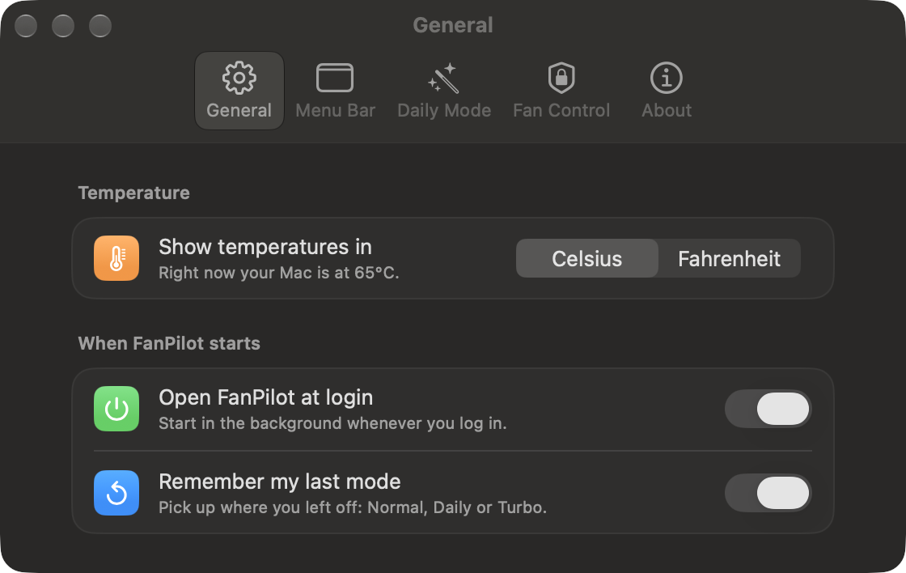
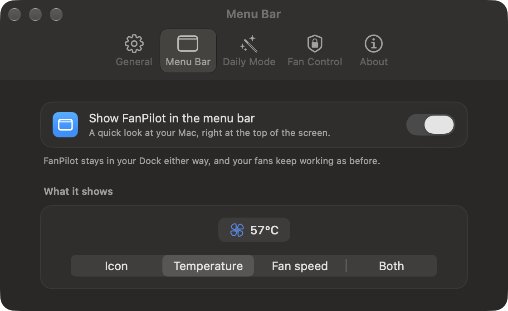
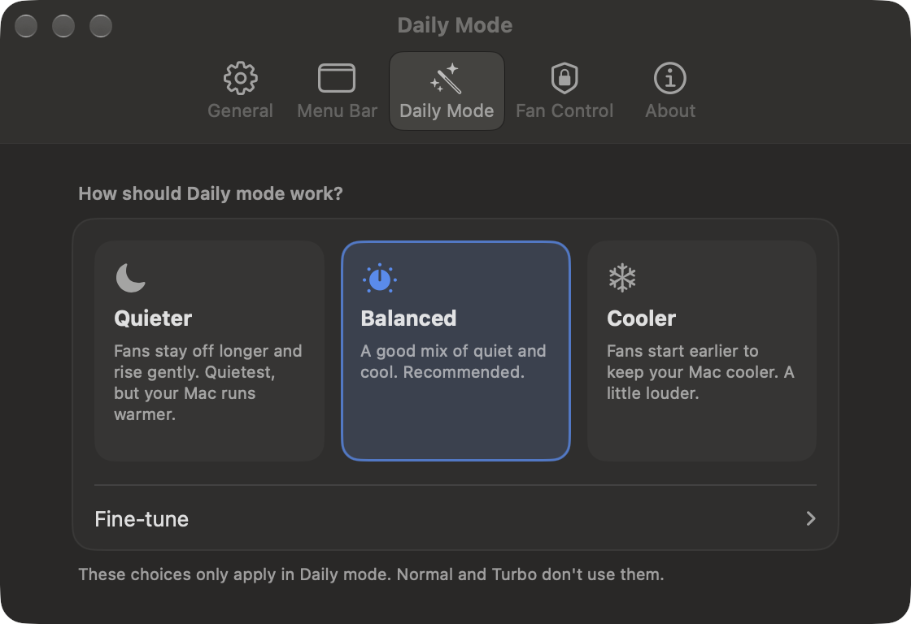
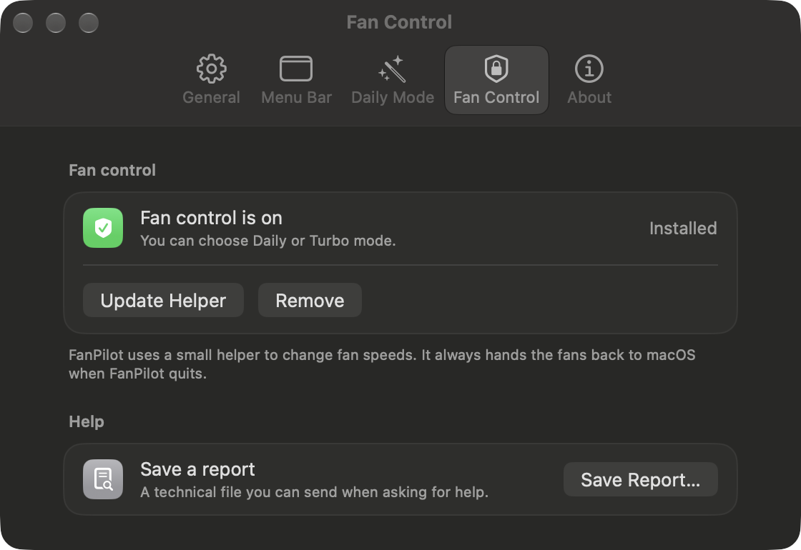
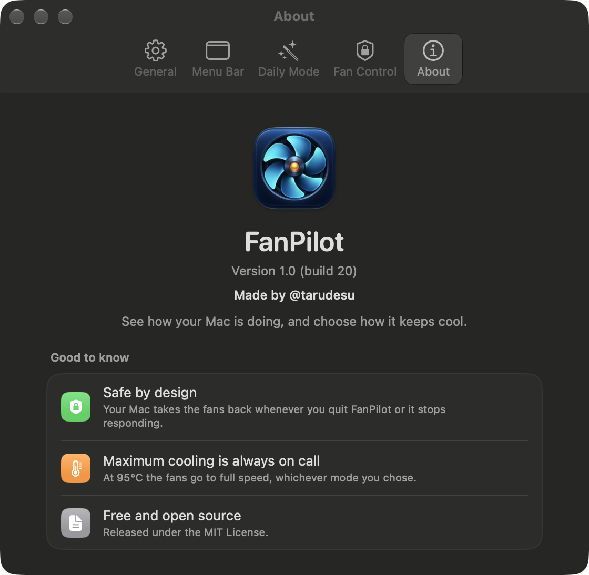

# FanPilot

**See how your Mac is doing, and choose how it keeps cool.**

FanPilot is a free, native macOS menu-bar app that shows your Mac's temperature and fan speed and lets you choose how the fans behave. It is built for Apple Silicon Macs that have fans (such as the MacBook Pro) and is written in Swift and SwiftUI.

<p align="center">
  
</p>

> Made by [@tarudesu](https://github.com/tarudesu). MIT licensed. Not affiliated with Apple or with any other fan-control app.

## What it does

FanPilot has three modes. The first choice is simply *who controls the fans*:

| Mode | Who controls the fans | What happens |
|---|---|---|
| **Normal** | macOS | FanPilot only watches. This is how your Mac behaves without FanPilot. |
| **Daily** | FanPilot, when needed | Fans stay off while your Mac is cool. As it heats up they rise smoothly, earlier and more gently than macOS would. When it cools down, FanPilot hands the fans back. |
| **Turbo** | FanPilot, always | Both fans at their maximum until you pick another mode. |

When you choose Daily, one extra choice appears: **Quieter · Balanced · Cooler**. It sets how early the fans start and how hard they work (Balanced starts at about 60 °C). The expert sliders are under *Fine-tune* in Settings → Daily Mode.

Other things you get:

- An animated fan and temperature gauge, plain-language status ("Cool and quiet", "Keeping your Mac cool", "Maximum cooling"), and a collapsed *Details* view with fan RPM and the hottest sensors.
- A menu-bar item showing the icon, the temperature, the fan speed, or both. It is coloured by mode (blue for Daily, orange for Turbo) and can be hidden.
- Celsius or Fahrenheit everywhere, defaulting to your region.
- Light and dark appearance, VoiceOver labels, and Reduce Motion support.
- A one-button "Turn On Fan Control" for first-time setup, and a "Save a report" file for troubleshooting.

<details>
<summary>More screenshots</summary>

| General | Menu Bar |
|---|---|
|  |  |

| Daily Mode | Fan Control |
|---|---|
|  |  |

| About |
|---|
|  |

</details>

## Requirements

- macOS 14 or later.
- An Apple Silicon Mac with fans. On a fanless Mac (MacBook Air) FanPilot runs in monitor-only mode.
- Intel Macs are not supported.
- An administrator password, once, to install the helper (see below).

## Install

FanPilot cannot be distributed through the Mac App Store because it needs low-level hardware access. There is no notarized download yet, so the way to get it is to **build it from source** (about five minutes; it has been used with an Apple Development certificate, which Xcode can create for you).

```sh
git clone https://github.com/macfreeapps/fanpilot.git
cd fanpilot
brew install xcodegen          # once
scripts/set-team-id.sh YOURTEAMID   # your 10-character Apple Team ID, see "Signing" below
xcodebuild -project FanPilot.xcodeproj -scheme FanPilot -configuration Release -derivedDataPath .build build
cp -R .build/Build/Products/Release/FanPilot.app /Applications/
open /Applications/FanPilot.app
```

Then in FanPilot choose **Turn On Fan Control**. macOS asks for your password once; this installs a small helper (see [How it works](#how-it-works)). The app must be in `/Applications` for the helper to install.

### Signing

The helper only accepts connections from an app signed by the **same Apple Developer team**, so the Team ID appears in the project settings and in the helper's trust check. `scripts/set-team-id.sh` replaces it everywhere and regenerates the Xcode project. You can find your Team ID in *Xcode → Settings → Accounts*, or at developer.apple.com → Membership. An "Apple Development" certificate is what FanPilot has been built and run with; public distribution would need a Developer ID certificate and notarization.

### Uninstall

*Settings → Fan Control → Remove* restores the fans to macOS and removes the helper, its LaunchDaemon and its state folder. Then delete `FanPilot.app`.

## How it works

```
┌────────────────────────────────┐   XPC    ┌──────────────────────────────────────┐
│ FanPilot.app  (your user)      │ ───────▶ │ FanPilotHelper  (root LaunchDaemon)  │
│  • SwiftUI window + menu bar   │ ◀─────── │  • the only process that writes SMC  │
│  • reads the SMC read-only     │ heartbeat│  • runs the Daily curve once a second│
│  • sends the mode you choose   │          │  • restores control on any failure   │
└────────────────────────────────┘          └──────────────────┬───────────────────┘
                                                               │ IOKit
                                                        AppleSMC (fans, sensors)
```

- **Reading** temperatures and fan speed needs no special rights, so the app does it directly.
- **Writing** fan settings needs root. A small helper installed as a LaunchDaemon is the only process that does, and it **only writes the fan mode, fan target and unlock keys** (`F<n>Md`/`F<n>md`, `F<n>Tg`, `Ftst`). It never writes the fans' minimum or maximum, and it clamps every target to the range the fan itself reports.
- **Apple Silicon unlock.** Recent chips keep the fans under the thermal manager and reject manual mode, so the helper uses the unlock sequence known from public research (set `Ftst`, wait for the thermal manager to yield, retry the mode write). The mode-key spelling (`F0Md` vs `F0md`), whether `Ftst` exists, the fan count and the sensor set are all discovered at runtime; nothing is keyed to a Mac model.
- **Control loop.** Daily reads the hottest CPU/GPU die sensor, filters it (fast to rise, slow to fall), and ramps the fans along a curve. It rises instantly and falls at a limited rate, and it hands control back to macOS after the Mac has stayed cool for a while.

## Safety

Controlling fans can overheat hardware if done badly, so the design assumes things go wrong:

- **Fans always go back to macOS** when FanPilot quits, crashes, loses its connection, or stops sending its heartbeat (15-second timeout), and when the helper receives SIGTERM.
- **Crash recovery.** Before the first manual write the helper records its intent on disk. If the helper itself dies, launchd restarts it and it restores control first. A failed recovery is retried every few seconds.
- **Last resort.** If the helper cannot release the fans, it drives them to maximum rather than leaving a stale, possibly low, speed. A second watchdog on its own queue restarts the helper if the control loop ever stalls.
- **Full speed when it matters:** at 95 °C, and whenever macOS reports *serious* or *critical* thermal pressure (which also covers battery and SSD heat the die sensors don't see). If the sensors become unreadable, Daily gives the fans back to macOS.
- **Other tools.** If another fan utility already has the fans in manual mode, FanPilot refuses to take over and says so.
- **Sleep.** The firmware resets manual control during sleep; FanPilot re-engages after wake.
- **Locked down access.** The helper accepts connections only from FanPilot, checked against its code signature, and re-validates every setting it receives.

`fanpilotctl` (a diagnostic tool, see below) is read-only unless you explicitly run its `test-engage` or `restore` commands as root.

## Tested on, and not tested on

Everything has been run on **one machine: a MacBook Pro with an M4 Pro (`Mac16,8`, two fans) on macOS 27.0.** On that machine:

| Check | Result |
|---|---|
| Turbo from idle fans | Both fans at maximum (7,826 RPM) in about 8 s |
| Quit, force-quit, and helper `kill -9` while in Turbo | Fans back under macOS control within about a second |
| Sleep for 2 min in Turbo | Control re-established about 7 s after wake |
| Another tool already holding a fan (simulated with `fanpilotctl test-engage`) | FanPilot refused and wrote nothing; recovered once the other tool let go |
| 20-minute all-core load in Daily | Hottest sensor peaked at 87.8 °C, never reached 95 °C, no throttling signature (`kernel_task` average 15.9 %) |
| Clean uninstall, then fresh install from the DMG | Passed (same user account) |
| Unit tests | 26 tests against a fake SMC (codecs, unlock state machine, Daily engine, formatters) |

**Not tested:** any other chip (M1, M2, M3, M5 code paths exist but have never run on those machines), other macOS versions (14 is the declared minimum), a separate user account, a Mac that isn't a laptop, an 8-hour soak on the final build, and notarized distribution. If you try it on another Mac, please share the output of *Settings → Fan Control → Save a report*.

The full log, including the bugs found and fixed along the way, is in [docs/ENGINEERING_NOTES.md](docs/ENGINEERING_NOTES.md).

## Troubleshooting

- **The fans show 0 RPM.** That is normal. Apple Silicon Macs switch the fans off completely when the Mac is cool.
- **"Another fan app seems to be in control."** Quit Macs Fan Control, TG Pro or similar, then pick a mode again.
- **Daily / Turbo are greyed out.** Fan control isn't turned on; use *Turn On Fan Control*.
- **It won't install the helper.** FanPilot must be in `/Applications`, and the app must be signed by the same team as the helper (see *Signing*).
- **The menu-bar icon is missing.** It may be hidden by a menu-bar manager or by the notch; also check *Settings → Menu Bar → Show FanPilot in the menu bar*.

## Develop

```sh
brew install xcodegen
xcodegen generate                                   # regenerate FanPilot.xcodeproj from project.yml
swift test --package-path Packages/FanCore          # unit tests, no hardware needed
```

```
FanPilot/            the app (SwiftUI): views, monitor, helper client and installer
FanPilotHelper/      the root helper: control loop, safety watchdogs, XPC service, LaunchDaemon plists
Packages/FanCore/    shared Swift package: SMC access, discovery, Daily engine, fake SMC, tests, `fanpilotctl`
scripts/             set-team-id.sh, loadtest.sh (sustained-load check), soak.sh (long-run memory/restart check)
docs/                engineering notes and screenshots
```

All SMC access goes through the `SMCDevice` protocol, and the control logic is tested against `FakeSMC` before it ever touches hardware. Writes go through a single allow-listed function.

### `fanpilotctl`

```sh
swift build --package-path Packages/FanCore --product fanpilotctl
fanpilotctl dump                              # read-only: fans, key variants, sensors
sudo fanpilotctl test-engage 0 3000 90        # hold fan 0 at 3000 RPM for 90 s, then release (root)
sudo fanpilotctl restore                      # force every fan back to macOS control (root)
```

### Hardware checks

`scripts/loadtest.sh [minutes] [abort °C]` runs an all-core load while logging temperature, fan speed and `kernel_task` CPU to a CSV (start FanPilot in Daily first). `scripts/soak.sh [hours]` samples memory, CPU, helper restarts and fan-mode changes every 30 s for a long run.

## Contributing

Issues and pull requests are welcome, especially reports from other Mac models. Because this code writes to fan hardware, changes that touch the helper or the SMC write path need a test against `FakeSMC` and a note on how they were checked on a real Mac. Please don't add new SMC write keys without discussing it first.

## Credits and references

Written by [@tarudesu](https://github.com/tarudesu). The Apple Silicon behaviour was learned from public research and open-source projects (`macos-smc-fan`, `exelban/stats`, `MacFanControl`, `SMCKit`); they were used as references for how the hardware behaves.

## License

[MIT](LICENSE)
