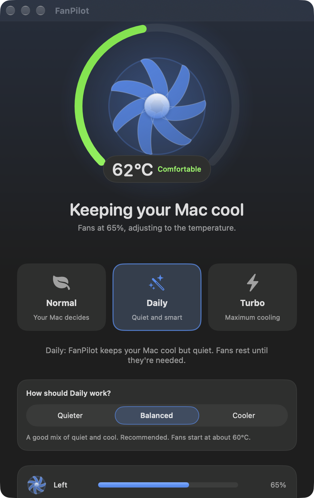

# FanPilot

**See how your Mac is doing, and choose how it keeps cool.**

A free, native macOS menu-bar app for Apple Silicon Macs with fans. It shows temperature and fan speed, and lets you pick how the fans behave.

<p align="center">
  
</p>

## Install

**Homebrew**

```sh
brew install --cask macfreeapps/tap/fanpilot
```

**Or download** `FanPilot-1.0.0-arm64.dmg` from the [latest release](https://github.com/macfreeapps/fanpilot/releases/latest) and drag FanPilot to Applications.

Then open FanPilot and click **Turn On Fan Control**. macOS asks for your password once, to install the small helper that changes fan speeds.

Needs macOS 14 or later and an Apple Silicon Mac with fans (on a fanless Mac it just shows temperatures).

> **First launch.** FanPilot is not notarized by Apple, so macOS will warn that it can't check the app. Homebrew clears that warning for you. With the DMG: open *System Settings → Privacy & Security* and choose **Open Anyway**, or run `xattr -dr com.apple.quarantine /Applications/FanPilot.app`.

## Three modes

| Mode | Who controls the fans | In short |
|---|---|---|
| **Normal** | macOS | FanPilot only watches. |
| **Daily** | FanPilot, when needed | Fans rest while the Mac is cool, rise smoothly as it heats up, and go back to macOS afterwards. Choose **Quieter · Balanced · Cooler**. |
| **Turbo** | FanPilot | Both fans at full speed until you pick another mode. |

Also: a menu-bar item you can hide, Celsius or Fahrenheit, light and dark appearance.

## Safe by design

Your Mac takes the fans back whenever FanPilot quits, crashes, or stops responding, and after sleep. The helper recovers from its own crashes, goes to full fan speed at 95 °C or under serious thermal pressure, and refuses to take over fans another tool is controlling. Details in [docs/DESIGN.md](docs/DESIGN.md).

## Good to know

- **Tested on one Mac** (MacBook Pro, M4 Pro, macOS 27.0). Other chips and macOS versions are untested; please [open an issue](https://github.com/macfreeapps/fanpilot/issues) if it misbehaves.
- **Not notarized, and the signing certificate expires on 28 June 2027.** The published build is signed with the author's Apple Development certificate. After that date fan control in this build may stop working and a new release will be needed. You can always [build it yourself](docs/DESIGN.md#build-from-source).
- Fans showing **0 RPM** is normal: Apple Silicon Macs switch them off completely when cool.

## Uninstall

```sh
brew uninstall --cask fanpilot
```

Homebrew also stops and removes the helper (it asks for your password). Without Homebrew: *Settings → Fan Control → Remove*, which hands the fans back to macOS and removes the helper, then delete the app.

## More

[Design, safety and development](docs/DESIGN.md) · [Changelog](CHANGELOG.md) · [Engineering notes](docs/ENGINEERING_NOTES.md)

Made by [@tarudesu](https://github.com/tarudesu) · [MIT License](LICENSE) · Not affiliated with Apple.
